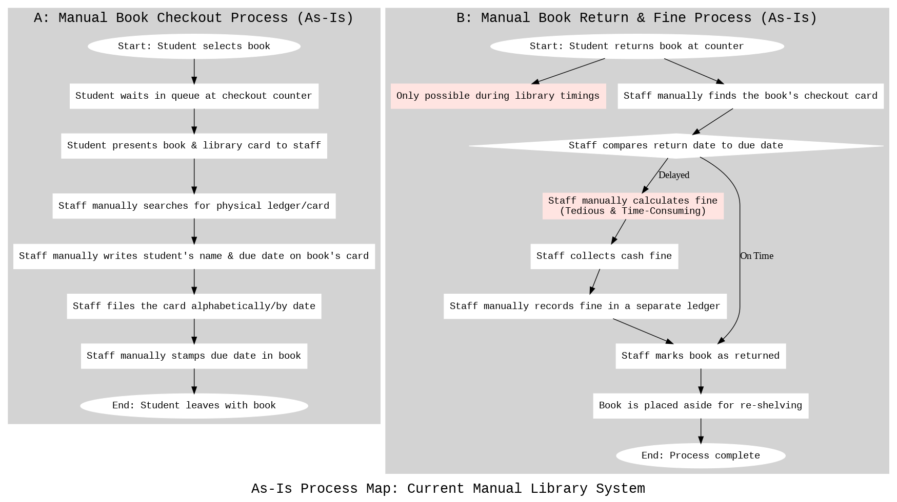
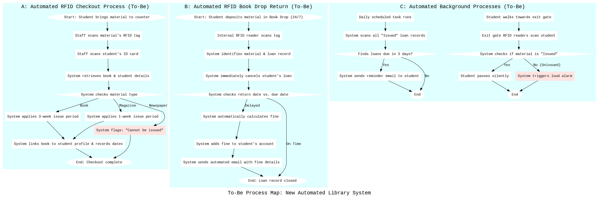
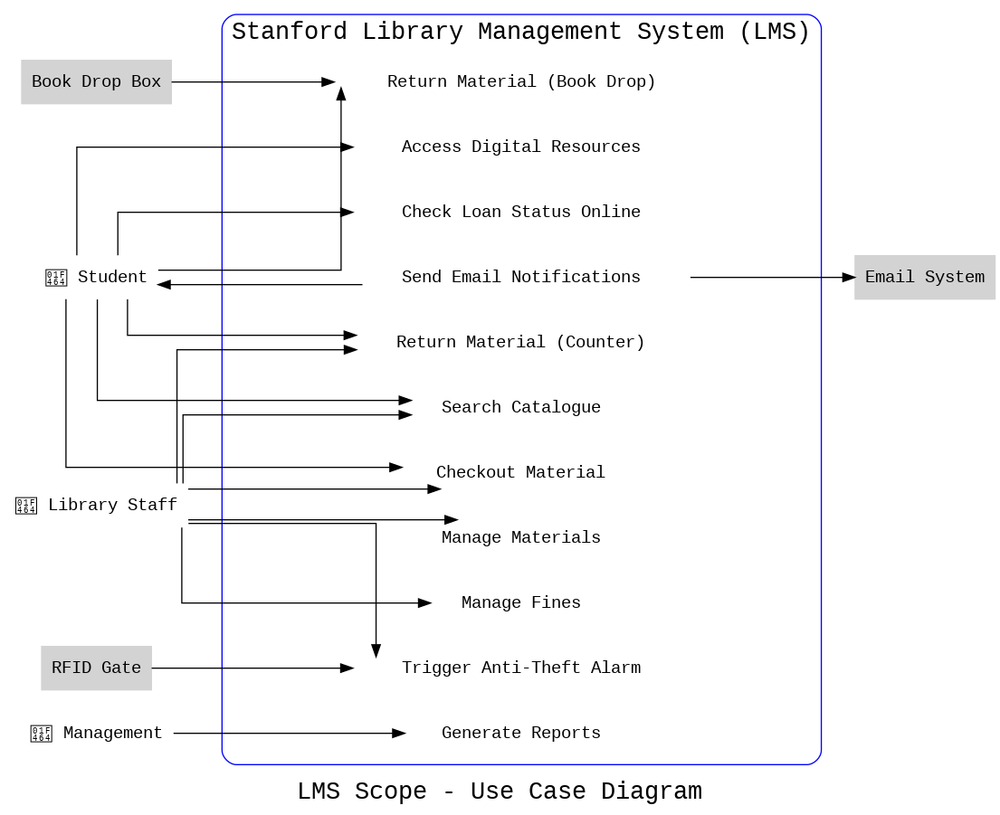
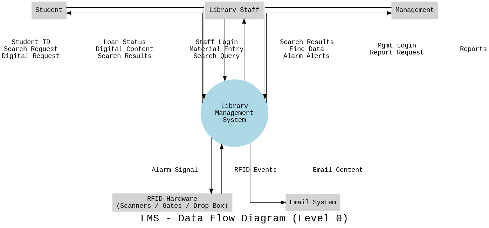
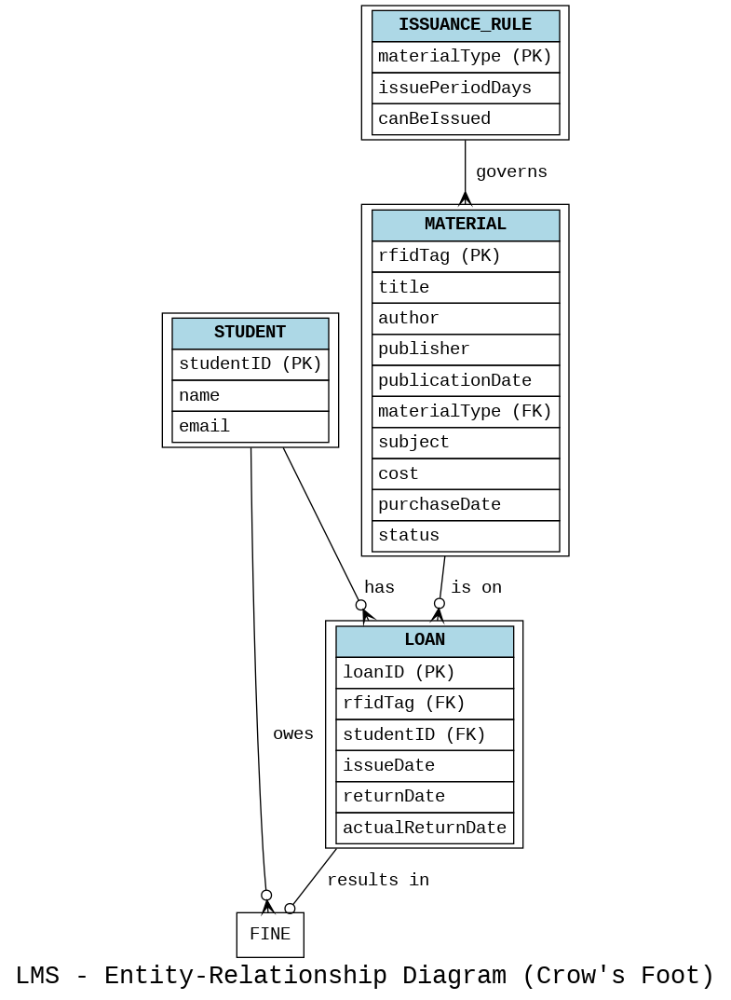

<!-- ============================================================
      🔥 STANFORD LIBRARY MANAGEMENT SYSTEM — SIGNATURE HEADER 🔥
      This header is built to impress recruiters & GitHub readers.
      Replace ADD_LINK_HERE where needed.
=============================================================== -->

# 📚 **Stanford Library Management System (LMS)**  
### *“Reimagining how 20,000 students interact with knowledge.”*

---

<!-- Animated Badge -->

---

<!-- Shiny Shields -->

  
  
  
  

---

<!-- Cinematic Banner -->

---

### 🏛️ *A complete business analysis and system blueprint for Stanford's next-generation Library Management Platform.*

**Includes:**  
🔎 As-Is & To-Be workflows  
📊 DFD + ERD + Use Case diagrams  
🧩 Python-generated prototypes  
🖥️ Staff-facing wireframes  
📘 Final BA document *(PDF)*  

📄 **Full Report:**  
👉 [Library Management System Project — PDF](ADD_LINK_HERE)

---

<!-- Quick Summary Cards -->
<table>
<tr>
<td align="center">
  
### 🎯 **Purpose**  
Digitize and automate Stanford’s library operations  
(4M+ books & 20,000+ students)

</td>
<td align="center">

### 🧠 **Core Deliverables**  
Business Analysis • Diagrams • Wireframes • Python Prototypes  

</td>
<td align="center">

### 🛠️ **Tech & Tools**  
UML • Python • System Modeling • Wireframing

</td>
</tr>
</table>

---

<!-- End of header block -->

# 📚 Stanford Library Management System (LMS)

This project presents the complete **Business Analyst deliverables** for the Stanford University Library Management System — including **process diagrams, data models, wireframes, and Python scripts** used to generate prototypes.

The repository follows an industry-standard structure, making it easy to understand the system from **As-Is → To-Be → Data → Requirements → UI/UX**.

---

# 🏛️ 1. Project Overview

The Stanford LMS aims to replace the outdated manual library system with an automated, scalable, and accurate digital platform.  
This project includes:

- As-Is analysis  
- To-Be improved process  
- DFDs, ER diagrams, Scope diagrams  
- Functional & Non-Functional requirements  
- Wireframe mock-screens  
- Python scripts for diagram/wireframe generation  
- Final business analysis PDF  

Full PDF report: [Library Management System Project By Mohith](https://github.com/mohithgaru/Stanford-LMS-Project/blob/main/docs/Library%20Management%20System%20Project%20By%20Mohith.pdf)

# 🔄 2. As-Is & To-Be Process Maps

### **📍 As-Is Process (Current Manual System)**  
This shows how books are currently managed manually.

### **📍 To-Be Process (Future Automated LMS)**  
Represents the improved flow after automation.

🔗 Diagrams folder: [Daigram Folder](https://github.com/mohithgaru/Stanford-LMS-Project/tree/main/diagrams)

---

# 🧠 3. System & Data Modeling

## **📌 Use Case Diagram (Scope Overview)**  
Shows all user interactions with the system.

---

## **📌 Data Flow Diagram (DFD)**  
Illustrates how information moves through LMS.

---

## **📌 Entity Relationship Diagram (ERD)**  
Defines the database structure for ISSUANCE, STUDENT, MATERIAL, LOAN, FINES, etc.

---

# 📝 4. Requirements

The full detailed requirements (FRs/NFRs) are included in the PDF and docs.

Docs folder: ADD_LINK_HERE

---

# 🖥️ 5. Wireframes (UI/UX Mock Screens)

These represent staff-facing screens — designed using Python scripts.

### **Book Record Creation Wireframe**

### **Student Checkout Wireframe**

🔗 Wireframes folder: ADD_LINK_HERE

---

# 🐍 6. Python Scripts (Prototype Generators)

Each diagram/wireframe has an associated Python script.

| Diagram / Wireframe        | Script Path |
|----------------------------|-------------|
| As-Is Flowchart            | [python/flowchart_as_is.py](https://github.com/mohithgaru/Stanford-LMS-Project/blob/main/python/As_is%20Process%20Map.py) |
| To-Be Flowchart            | [python/flowchart_to_be.py](https://github.com/mohithgaru/Stanford-LMS-Project/blob/main/python/to%20be%20process%20map.py) |
| ER Diagram                 | [python/er_diagram.py](https://github.com/mohithgaru/Stanford-LMS-Project/blob/main/python/Er%20daigram.py) |
| DFD Diagram                | [python/dfd_diagram.py](https://github.com/mohithgaru/Stanford-LMS-Project/blob/main/python/Data%20Flow%20Daigram.py) |
| Use Case Diagram           | [python/use_case_diagram.py](https://github.com/mohithgaru/Stanford-LMS-Project/blob/main/python/Use%20case%20diagram.py) |
| Book Record Wireframe      | [python/wireframe_book_record.py](https://github.com/mohithgaru/Stanford-LMS-Project/blob/main/wireframes/screenshots/wireframe%201.jpg) |
| Checkout Screen Wireframe  | [python/wireframe_checkout.py](https://github.com/mohithgaru/Stanford-LMS-Project/blob/main/wireframes/screenshots/wireframe%202.jpg) |

Python folder:(https://github.com/mohithgaru/Stanford-LMS-Project/tree/main/python)

---

# 🧾 7. Folder Structure

/docs → PDFs, Reports
/diagrams → PNG diagrams
/python → Python code
/wireframes → Screenshots + scripts
 
yaml
Copy code

---

# ✔️ Summary

This repo represents a **complete BA project** with:

- Full documentation  
- Diagrams inside README  
- Clickable previews  
- Python prototypes  
- Clean & understandable structure  
